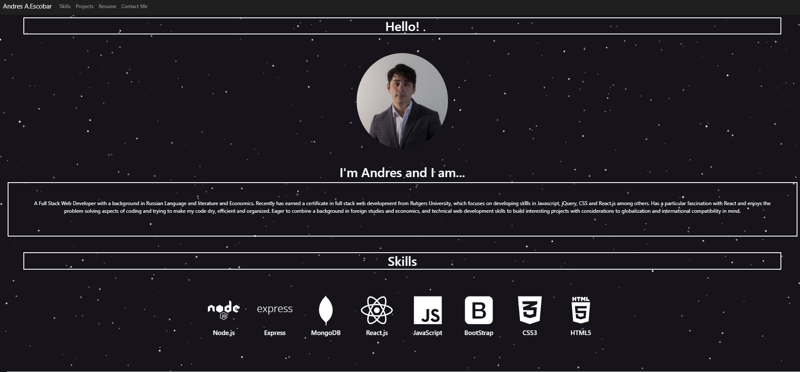

# mysite
My personal website

## Table of Contents  
[About](#About)  
[Installation](#Installation)    
[Future-Development](#future-development)   
[Questions](#questions)   

## About Project  
This is my, Andres Escobar's, personal website, where I will be showcasing my skills and projects along with links to my socials and resume.

The website was created using React.js, Javascript, Html5 and Css3.   
Tech used:  
[AOS](https://michalsnik.github.io/aos/) - was used for the scroll animations
[React Particles js](https://github.com/Wufe/react-particles-js) - was used for the particle star effect at the top of the page
[vincentgarreau.com](https://vincentgarreau.com/particles.js/) - was partly used in creating the particle configuration. It allowed me to visualize the particles before adding the config code.
[React Bootstrap](https://react-bootstrap.github.io/) - for inital styling and easy components.
[React Icons](https://react-icons.github.io/react-icons) - for importing socials icons

## Deployment  
This site is deployed through Github Pages.

[deployed-link](https://apemint.github.io/mysite/)  

## Preview

## Future-Development   
For the time being I am happy with this project. For the immediate future, updates will be for currently featured content, as in updating my skills, adding new projects, or updating my resume link. 

Eventually, I want to flesh out the contact section further, adding a contact form and an email link.

I also would like to possibly implement tailwind for styling, as that is something I have been enjoying using.

## Questions  
Please contact me via the links provided for any questions, concerns, compliments, or suggestions. :)

[My Github](https://github.com/apemint)
